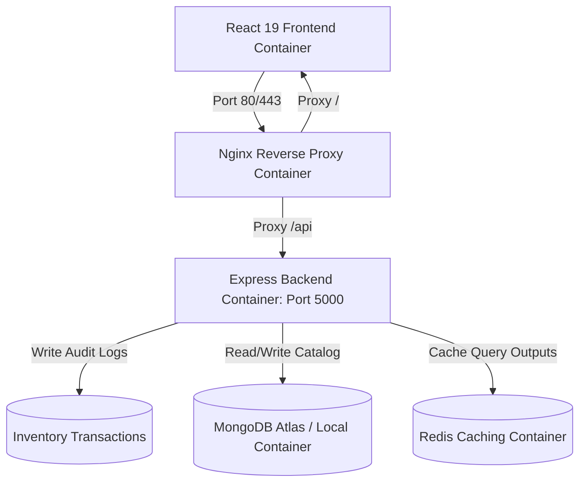

# StockVibe - MERN Inventory, Quotation, and Order Management Platform

StockVibe is a production-grade, enterprise-scale Inventory, Quotation, and Order Management System built on the MERN (MongoDB, Express, React, Node) stack. It incorporates unit-conversion capabilities, role-based access control (RBAC), Redis caching, automated Docker containerization, Nginx reverse proxying, CI/CD with GitHub Actions, and deployment guides for AWS EC2.

---

## 1. Project Overview

StockVibe addresses the operational needs of businesses managing variable-unit inventories (weight, volume, count). The platform enables sellers to build custom quotations using customizable metrics, translates configurations to standard base storage units on-the-fly, enforces stock reserves, and provides administrators with real-time analytics dashboards.

---

## 2. System Architecture



---

## 3. Features

* **Dual Role Dashboard**: Distinct views and actions for Administrators (catalog builder, stock audits, analytics charts) and Sellers (browse, quotation builder, order dispatcher).
* **Multi-Unit Pricing Engine**: Place orders in `kg`, `g`, `L`, `mL`, or `items`. Computations convert quantities internally to gram, milliliter, and count bases to compute costs.
* **Resilient Cache Layer**: Caches product catalogs and metrics in Redis, invalidating caches on product restocks or new order receipts.
* **Transactional Auditing**: Log every adjustment, checkout, or cancellation automatically.
* **Invoice Engine**: Free print layout formatting for invoices and receipts.

---

## 4. Folder Structure

```text
inventory-management/
├── docker-compose.yml           # Multi-container orchestration (base)
├── docker-compose.dev.yml       # Host mounts, hot-reloading dev compose
├── docker-compose.prod.yml      # Healthchecks, logging limits production compose
├── Dockerfile.client            # Multi-stage React + Nginx build
├── Dockerfile.server            # Secure non-root Node.js 22 alpine build
├── .github/
│   └── workflows/
│       └── ci-cd.yml            # GitHub Actions CI lint/test + CD EC2 SSH deploy
├── nginx/
│   └── default.conf             # Reverse proxy proxy_pass configurations
├── scripts/
│   ├── setup-ec2.sh             # Firewall, Docker, SSL setup script for Ubuntu
│   ├── deploy.sh                # SSH pull, compose up, seed post-rollout script
│   └── backup-mongodb.sh        # Automates daily gz db snapshot cron
├── server/
│   ├── package.json             # Backend dependencies & Vitest test runners
│   └── src/
│       ├── app.js               # Express apps, rate limits, registry middleware
│       ├── server.js            # Database bootstrap listen port config
│       ├── config/              # Winston loggers, Redis cache clients
│       ├── middleware/          # JWT verifications, RBAC filters, Zod parse checks
│       ├── validations/         # Zod schemas (register, login, orders)
│       ├── utils/               # AppError handler classes, pricing calculators
│       └── modules/             # Schema, Controller, Route folders
│           ├── auth/
│           ├── users/
│           ├── products/
│           ├── inventory/
│           ├── quotations/
│           ├── orders/
│           └── analytics/
└── client/
    ├── package.json             # React 19 dependencies & bundlers
    ├── vite.config.js           # Proxy routing rules
    ├── index.html               # Main page, Inter font loads
    ├── src/
    │   ├── main.jsx             # React entry wrapper
    │   ├── App.jsx              # Router tree registry
    │   ├── index.css            # Tailwind CSS directives, glassmorphic panels
    │   ├── components/          # ProtectedRoute guards
    │   ├── context/             # AuthContext provider
    │   ├── services/            # Axios API client, token refresh interceptor
    │   └── pages/               # Feature panels (admin, seller dashboards)
```

---

## 5. Database Schema Design

### Users
* `name`: String (trimmed)
* `email`: String (lowercase, unique index)
* `passwordHash`: String (hashed using bcrypt)
* `role`: String ('Admin' | 'Seller')

### Categories
* `name`: String (unique)
* `description`: String

### Products
* `sku`: String (unique, uppercase index)
* `name`: String (text search index)
* `description`: String
* `categoryId`: ObjectId (ref Category)
* `baseUnit`: String ('g' | 'mL' | 'item')
* `basePrice`: Number (per base unit)
* `inventoryQuantity`: Number (stored in base unit)
* `active`: Boolean

### Quotations
* `quotationNumber`: String (unique index)
* `userId`: ObjectId (ref User)
* `items`: Array of:
  - `productId`: ObjectId (ref Product)
  - `quantity`: Number (ordered quantity)
  - `unit`: String ('g' | 'kg' | 'mL' | 'L' | 'item')
  - `baseQuantity`: Number (internal standard conversion)
  - `pricePerUnit`: Number (calculated rate per ordered unit)
  - `subtotal`: Number
* `totalAmount`: Number
* `status`: String ('Pending' | 'Approved' | 'Rejected' | 'Expired')

### Orders
* `orderNumber`: String (unique index)
* `userId`: ObjectId (ref User)
* `items`: Array (same structure as quotation items)
* `totalAmount`: Number
* `status`: String ('Pending' | 'Processing' | 'Shipped' | 'Delivered' | 'Cancelled')

### InventoryTransactions
* `productId`: ObjectId (ref Product)
* `transactionType`: String ('IN' | 'OUT' | 'ADJUSTMENT')
* `quantity`: Number (stock level delta)
* `notes`: String

---

## 6. Unit Conversion Strategy

We standardize variables to eliminate rounding discrepancies and database inconsistencies:

1. **Weight**: Stored as **Grams (`g`)**.
   - Input: $2\text{ kg} \rightarrow 2 \times 1000 = 2000\text{ g}$.
2. **Volume**: Stored as **Milliliters (`mL`)**.
   - Input: $1.5\text{ L} \rightarrow 1.5 \times 1000 = 1500\text{ mL}$.
3. **Count**: Stored as **Item (`item`)**.
   - Input: $12\text{ items} \rightarrow 12\text{ items}$.

### Pricing calculations
Pricing rates are configured internally per base unit (e.g. ₹0.08 per gram, ₹8.00 per egg). The pricing engine computes unit costs and totals:
$$\text{Price per ordered Unit (e.g. kg)} = \text{basePrice} \times 1000$$
$$\text{Subtotal} = \text{baseQuantity} \times \text{basePrice}$$

---

## 7. API Documentation

### Authentication
* `POST /api/auth/register` - Creates user profile
* `POST /api/auth/login` - Authenticates user & issues cookies
* `POST /api/auth/refresh` - Generates new access token
* `POST /api/auth/logout` - Revokes cookie credentials
* `GET /api/auth/me` - Resolves active session profile

### Products & Categories
* `POST /api/products/categories` - Create custom category (Admin only)
* `GET /api/products/categories` - List categories
* `POST /api/products` - Add product (Admin only)
* `PUT /api/products/:id` - Update catalog entry (Admin only)
* `GET /api/products/:id` - Get product details
* `GET /api/products` - Search, filter, and page products catalog

### Inventory
* `POST /api/inventory/adjust/:productId` - Post manual restock/audit adjustments (Admin only)
* `GET /api/inventory/transactions` - Fetch transaction audit logs (Admin only)

### Quotations & Orders
* `POST /api/quotations` - Submit quotation draft
* `GET /api/quotations` - Read quotation list
* `POST /api/orders` - Place order (from items list or quotation reference)
* `GET /api/orders` - Read orders queue
* `PUT /api/orders/:id/status` - Transition status (Admin only)

---

## 8. Development Setup (Local)

### Prerequisites
* Docker Desktop installed
* Node.js 22 LTS (optional, for local node tests)

### Launch development containers
Build images and start hot-reload containers:
```bash
docker compose -f docker-compose.yml -f docker-compose.dev.yml up --build
```
This boots up:
- MongoDB container (port `27017`)
- Redis container (port `6379`)
- Express App with nodemon (port `5000`)
- Vite React Dev server (port `3000`)

### Seed database
Populate base catalog categories, products, and default accounts:
```bash
docker exec -it stockvibe_backend npm run seed
```

---

## 9. Verification & Automated Tests

To execute tests locally on the host machine:
```bash
cd server
npm install
npm run test
```

---

## 10. AWS EC2 Production Deployment

### 1. Provision Ubuntu Host Instance
* Create EC2 running Ubuntu 24.04.
* Configure Security Group rules:
  - SSH: Port `22`
  - HTTP: Port `80`
  - HTTPS: Port `443`

### 2. Run Setup Script on EC2
Clone repository, copy scripts to host, and execute setup:
```bash
chmod +x scripts/setup-ec2.sh
./scripts/setup-ec2.sh
```

### 3. Deploy Platform
Configure environment variables in `/home/ubuntu/app/.env` and trigger deployment:
```bash
chmod +x scripts/deploy.sh
./scripts/deploy.sh
```
This logs in to GHCR, pulls the built production images, launches container networks, checks the API health endpoint, and performs seed validation.

---

## 11. Security Implementation

* **JWT Secure Sessions**: Dispatches tokens inside HTTP-only, secure, SameSite=none cookies to block XSS and CSRF.
* **Express Rate Limiting**: Limit connection requests per window to mitigate brute force attempts.
* **Helmet Guarding**: Sets HTTP response headers to secure headers.
* **Database Sanitization**: Prevents NoSQL Injection and scripting injection.

---

## 12. Credentials

* **Admin Profile**:
  - Email: `admin@example.com`
  - Password: `Password@123`
* **Seller Profile**:
  - Email: `seller@example.com`
  - Password: `Password@123`
